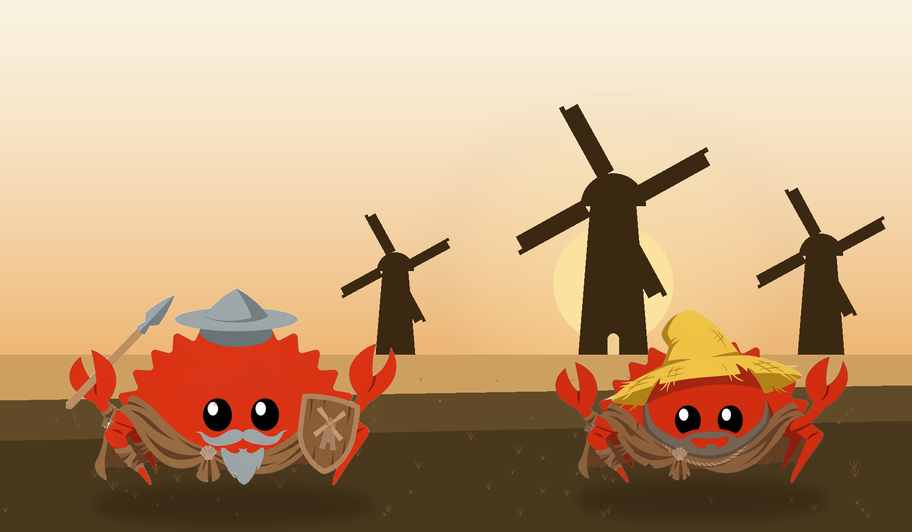
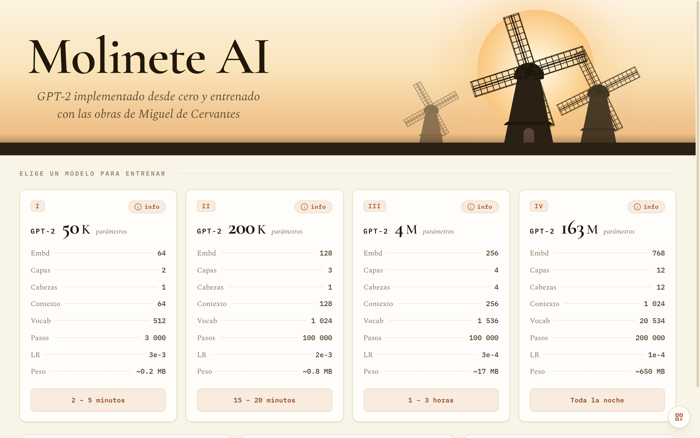
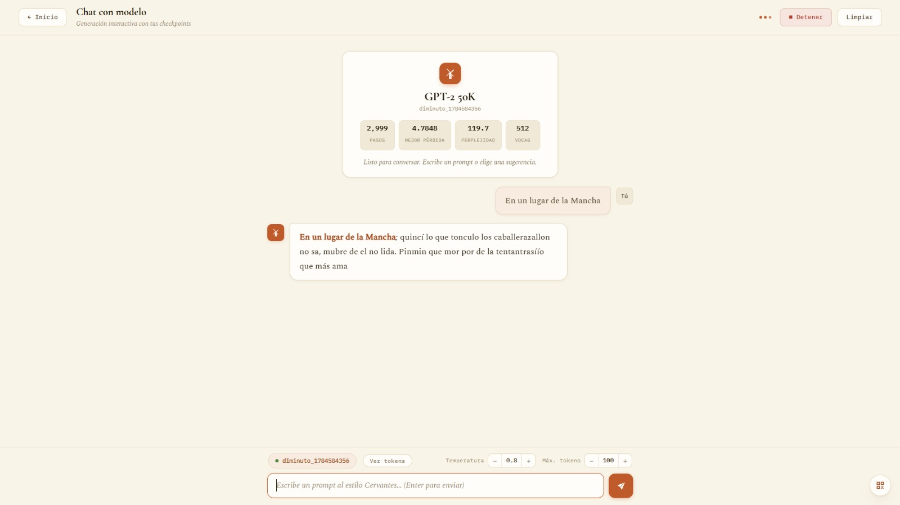
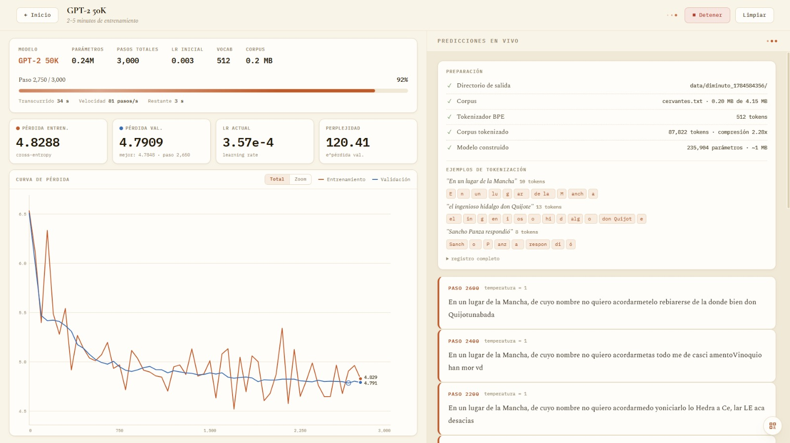
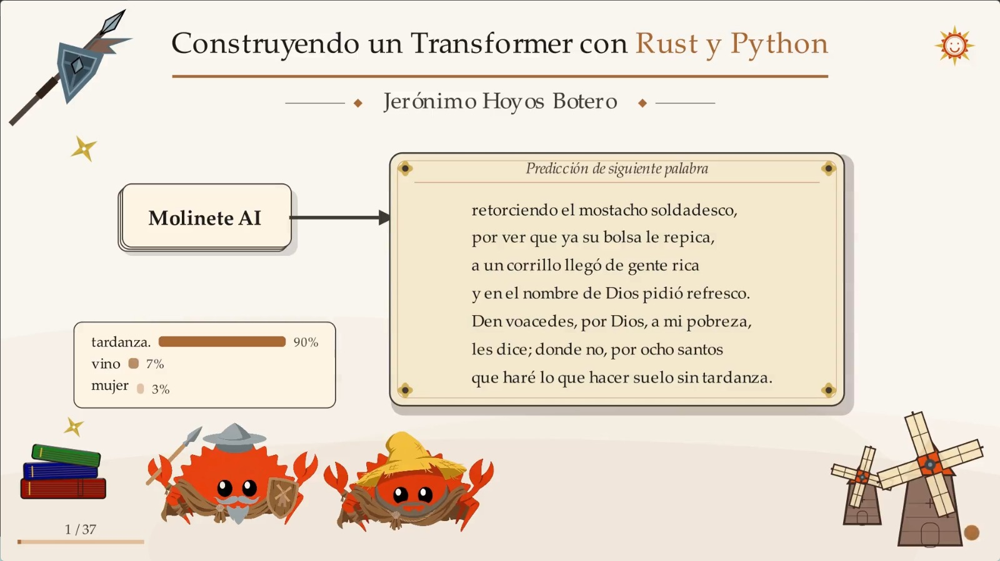

<div align="center">
<pre>
________________________________________________________________________________________________________8______________________
________________________________________________________________________________________________________8666___________________
________________________________________________________________________________________________________8_868__________________
________________________________________________________________________________________________________8_688_8________________
███╗░░░███╗░█████╗░██╗░░░░░██╗███╗░░██╗███████╗████████╗███████╗__░█████╗░██╗______88888________________8668888________________
████╗░████║██╔══██╗██║░░░░░██║████╗░██║██╔════╝╚══██╔══╝██╔════╝__██╔══██╗██║____888888888______________8___888_________88_8___
██╔████╔██║██║░░██║██║░░░░░██║██╔██╗██║█████╗░░░░░██║░░░█████╗░░__███████║██║____888_8888888____________8_____________8668888__
██║╚██╔╝██║██║░░██║██║░░░░░██║██║╚████║██╔══╝░░░░░██║░░░██╔══╝░░__██╔══██║██║_____668888888888_________86___________8688__8888_
██║░╚═╝░██║╚█████╔╝███████╗██║██║░╚███║███████╗░░░██║░░░███████╗__██║░░██║██║_______8668__888888________8_________868888888888_
╚═╝░░░░░╚═╝░╚════╝░╚══════╝╚═╝╚═╝░░╚══╝╚══════╝░░░╚═╝░░░╚══════╝__╚═╝░░╚═╝╚═╝_________86688__88888_____86_______868888888888___
________________________________________________________________________________________866888888888__88868___8688_8888888_____
__________________________________________________________________________________________866888888_86888888888_88888888_______
____________________________________________________________________________________________866888_88888886888__88888__________
_________________ /\ ____ ,, _________________________________________________________________86688688888888668__88____________
________  .---. __|| ____ /|| __________________________________________________________________86688888886888888______________
______ --'-----`--||    .'  \ __________________________________________________________________88666688666888888______________
________ {{{N `(  ||  .'    @  _______________________________________________________________8868868888688888888______________
________ {{{` _/  ||.'    |  \  ____________________________________________________________88888888866888688_8_88_____________
________ {{{.-.   ||  /  /\   \  __________________________________________________________888868_868_888_86668886_____________
________  {( )| .'||    /  `.  \  ________________________________________________________888_68866__888888_866__8_____________
__        {|\ \'  / )  / __  \\O| ______________________________________________________8888__8868____888888__86888____________
  `-.____.-| \ \ /\/  / ____ `'   ____________________________________________________88888__8668_______888888__866____________
 -    ////|  \ Y /|  | ______________________________________________________________88888__666888_______8888888__868__________
   |   |||||`-|\^/|| |   __________________________________________________________888888_86668_88__________888888__66_________
       |||||`-| " [] / ___________________________________________________________88888__66_68888_____________888888__68_______
      _ \\\\/`-|   []|\  ________________________________________________________88888__866__6_888__88888_______888886__668____
 ) |`---``| _ |__([]| \   ______________________________________________________88888__86___688888__888_8________888886__8668__
  / ____  |/ `|  FJ|\ \   ______________________________________________________8888_866____686886_86688888__666__888868___868_
 / _____  `|  |  FJ) \ \    ______________________________________________________8_868____6886_88_68888886__868__8__866_88____
/ ______   |  |  FJ|  \ )  ________________________________________________________86______6_68_88_6_8888_8__868___8__868______
| ______   |  F  J  L  || ________________________________________________________________88866_88_8_6688_8__888___8___86______
`.  ____   )-(> '----` || ________________________________________________________________6_888888_8_8688_8________8____68_____
`.\  ___   | |    |||  || _______________________________________________________________86___6668868888888688___886688_86_____
| \\  __   |-|    ||| / | _______________________________________________________________6888888668888888866888888_88688868____
 \ )\    *_)/`-.__|| \\ | ____________________________________________________________8888888888888_88888_8888888_888888886____
--'--'"""""`------''--'`'"""""""""""""""""""""""""""""""""""""""""""""""""""""""""""""888888888888888888888888888888888888888""
</pre>

# Molinete AI

**Un Transformer GPT-2 implementado desde cero en Rust, entrenado con las obras de Miguel de Cervantes.**

[](LICENSE)
[](https://www.rust-lang.org/)
[](https://www.python.org/)
[](https://github.com/PyO3/maturin)

**Autor:** Jerónimo Hoyos Botero  
**Basado en:** [tag1consulting/feste](https://github.com/tag1consulting/feste)

<br>



*El ingenioso hidalgo Don Ferris de la Mancha y su fiel escudero*

</div>

---

## Tabla de contenidos

- [¿Qué es Molinete AI?](#qué-es-molinete-ai)
- [¿Por qué "Molinete"?](#por-qué-molinete)
- [Estructura del repositorio](#estructura-del-repositorio)
- [Inicio rápido](#inicio-rápido)
- [Librería de Python](#librería-de-python)
- [Interfaz web](#interfaz-web)
- [Presentación](#presentación)
- [Diferencias frente al repositorio original](#diferencias-frente-al-repositorio-original)
- [Bibliografía](#bibliografía)
- [Licencia](#licencia)

---

## ¿Qué es Molinete AI?

Molinete AI es un fork de **Feste**, una implementación desde cero de un modelo Transformer tipo GPT-2 en Rust, desarrollada por Tag1 Consulting como acompañamiento a la serie *Building an LLM From Scratch in Rust*.

Mientras que Feste entrena el modelo con las obras completas de Shakespeare, **Molinete AI propone entrenarlo con la obra de Miguel de Cervantes**, estableciendo una contraposición lingüística y cultural:

| Proyecto | Corpus | Idioma |
|:---|:---|:---|
| **Feste** | Shakespeare | Inglés isabelino |
| **Molinete AI** | Cervantes | Español del Siglo de Oro |


<div align="right"><a href="#molinete-ai">↑ Volver arriba</a></div>

---

## ¿Por qué "Molinete"?

Si Feste toma su identidad del bufón ingenioso de *Twelfth Night*, **Molinete AI** rinde homenaje a los famosos molinos de viento que el ingenioso hidalgo Don Quijote confundió con fieros gigantes, una metáfora para un modelo de lenguaje que intenta imitar la grandeza de algo mucho más vasto que él mismo.

<div align="center">

</div>

<div align="right"><a href="#molinete-ai">↑ Volver arriba</a></div>

---

## Estructura del repositorio

```
molineteai/
├── src/             ← Implementación del modelo en Rust (tensores, capas, entrenamiento)
├── docs/            ← Documentación: corpus (DATA.md) y API Python (REFERENCIA.md)
├── examples/        ← Ejemplos mínimos de la librería Python
├── presentation/    ← Presentación con animaciones Manim
├── web/             ← Interfaz web: servidor FastAPI, módulos Python y frontend
├── Cargo.toml       ← Proyecto Rust
└── pyproject.toml   ← Proyecto Python (gestionado con uv)
```

Cada carpeta tiene su propio README.md, donde se encuentra su documentación.

<div align="right"><a href="#molinete-ai">↑ Volver arriba</a></div>

---

## Inicio rápido

### Requisitos

- [Rust](https://rustup.rs/) 1.75+
- [`uv`](https://docs.astral.sh/uv/)

### 1. Clonar el repositorio

```bash
git clone https://github.com/JeroHoyos/Molinete-AI.git
cd Molinete-AI
```

### 2. Instalar dependencias y compilar

El proyecto está gestionado por `uv`.

```bash
uv sync
```


### 3. Preparar el corpus

El corpus de Cervantes debe descargarse antes de entrenar. Se puede hacer de dos formas:

- Desde la interfaz web (opción "Descargar el corpus").
- Con el script de ejemplo: `uv run python examples/00_descargar_corpus.py`

Ver [docs/DATA.md](docs/DATA.md) para más detalles .

### 4. Ejecutar el modelo

---

## Librería de Python

El siguiente es un ejemplo de uso de la librería:


```python
import molineteai

# Corpus
texto = open("cervantes.txt", encoding="utf-8").read()

# Tokenizador
tok = molineteai.TokenizadorBPE(1536)
tok.entrenar(texto, 1536)
ids = tok.codificar("En un lugar de la Mancha")
print(tok.decodificar(ids))

# Configuración y modelo
config = molineteai.Config.mediana(tok.tam_vocabulario())
modelo = molineteai.GPT2Entrenable(config)
print(f"Parámetros: {modelo.num_parametros():,}")

# Entrenamiento
modelo.entrenar(tok, texto, pasos=8000, tasa_aprendizaje=3e-4,
                dir_salida="data/run/", paciencia=3000)

# Generación
ids_out = modelo.generar(tok.codificar("En un lugar"), max_tokens=100, temperatura=0.8)
print(tok.decodificar(ids_out))
```

<div align="right"><a href="#molinete-ai">↑ Volver arriba</a></div>

---

Para la documentación completa de la API de Python, consulta [docs/REFERENCIA.md](docs/REFERENCIA.md).
En [examples/](examples/) encontrarás ejemplos ejecutables y comentados: descargar el corpus, entrenar los dos *presets* más pequeños y construir una arquitectura personalizada.

## Interfaz web

La interfaz del proyecto reúne todo el flujo de trabajo en el navegador. Desde ahí puedes descargar el corpus, explorar los módulos de aprendizaje, entrenar modelos con métricas en vivo, chatear con los checkpoints entrenados y comparar hasta 4 modelos respondiendo al mismo prompt.

<div align="center">


*La pantalla de inicio: cuatro presets de GPT-2, de 50K a 163M de parámetros, listos para entrenar.*
</div>

<div align="center">


*Conversando con un Molinete ya entrenado.*



*El dashboard de entrenamiento, con métricas y curva de pérdida en vivo..*
</div>


### Iniciar el servidor

```bash
uv run web/server.py
```

Luego abre **http://localhost:7860** en tu navegador.

### Puerto personalizado

```bash
PORT=8000 uv run web/server.py
```

<div align="right"><a href="#molinete-ai">↑ Volver arriba</a></div>

---

## Presentación

La carpeta `presentation/` contiene una charla con **animaciones desarrolladas en Manim** que explora visualmente cómo se construye un Transformer desde cero: tokenización, embeddings, mecanismos de self-attention, redes feed forward, conexiones residuales y generación autoregresiva.

<div align="center">


*Presentado en Medellín AI y en Pycon Colombia 2026.*
</div>

```bash
cd presentation
uv run python compilar.py       # renderiza y deja todo listo en portable/
cd portable
uv run python -m manim_slides present Presentacion
```

La carpeta `portable/` que genera la compilación es autocontenida y se puede llevar a otro PC (incluso Linux o Mac). Ver [presentation/README.md](presentation/README.md) para el detalle, y [presentation/portable/README.md](presentation/portable/README.md) para los controles y cómo presentar fuera del repositorio.

<div align="right"><a href="#molinete-ai">↑ Volver arriba</a></div>

---

## Diferencias frente al repositorio original

| Aporte | Descripción |
|:---|:---|
| **Corpus en español** | Cervantes en lugar de Shakespeare, con guía de descarga en [docs/DATA.md](docs/DATA.md) |
| **Módulos de exploración** | Módulos Python que aíslan y demuestran el comportamiento de cada componente |
| **Interfaz web** | Todo el proyecto se usa desde el navegador: aprendizaje, entrenamiento y chat |
| **Bindings Python** | API completa con PyO3/maturin para usar el modelo desde Python |
| **Ejemplos de la librería** | Scripts mínimos y comentados en [examples/](examples/): corpus, presets y arquitectura a medida |
| **Presentación Manim** | Animaciones de la arquitectura Transformer para uso pedagógico |
| **Documentación en español** | Explicaciones adicionales orientadas a la comprensión del código |

<div align="right"><a href="#molinete-ai">↑ Volver arriba</a></div>

---

## Bibliografía

### Libros

- Bishop, C. M., & Bishop, H. (2024). *Deep Learning: Foundations and Concepts*. Springer.
- Amidi, A., & Amidi, S. *Super Study Guide: Transformers and Large Language Models*.
- Kinsley, H., & Kukieła, D. *Neural Networks from Scratch in Python*.

### Videos

- 3Blue1Brown. *Neural Networks* (serie de video). YouTube. Disponible en: [https://www.youtube.com/watch?v=aircAruvnKk&list=PLZHQObOWTQDNU6R1_67000Dx_ZCJB-3pi](https://www.youtube.com/watch?v=aircAruvnKk&list=PLZHQObOWTQDNU6R1_67000Dx_ZCJB-3pi)
- Serrano, L. *The math behind Attention: Keys, Queries, and Values matrices*. YouTube. Disponible en: [https://www.youtube.com/watch?v=UPtG_38Oq8o](https://www.youtube.com/watch?v=UPtG_38Oq8o)

<div align="right"><a href="#molinete-ai">↑ Volver arriba</a></div>

--- 

## Licencia

Distribuido bajo la licencia **Apache 2.0**. Ver [LICENSE](LICENSE) para más detalles.

---

<div align="center">

*"En un lugar de la Mancha, de cuyo nombre no quiero acordarme..."*

</div>
